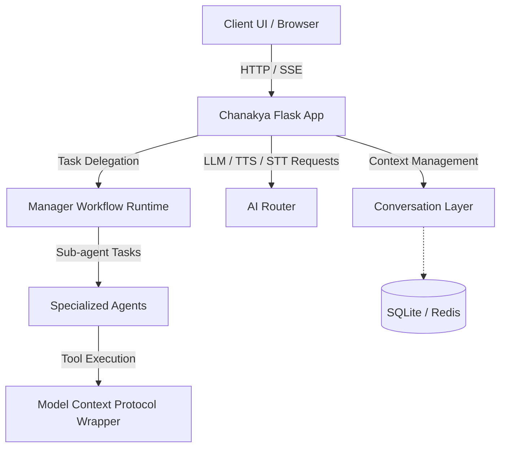
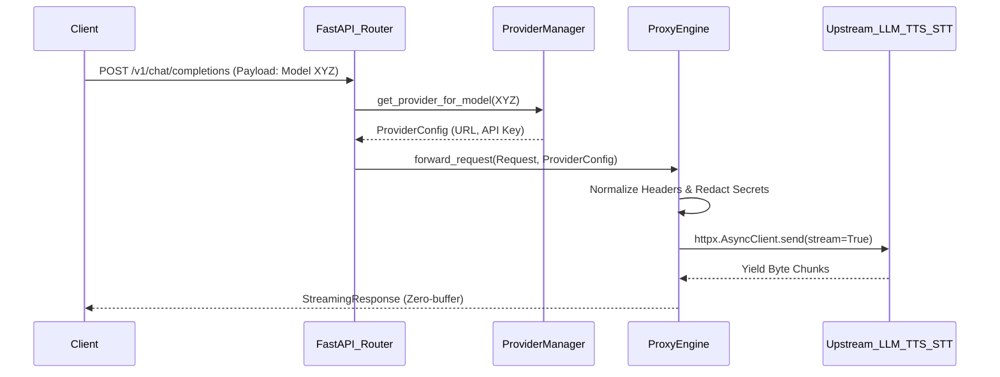
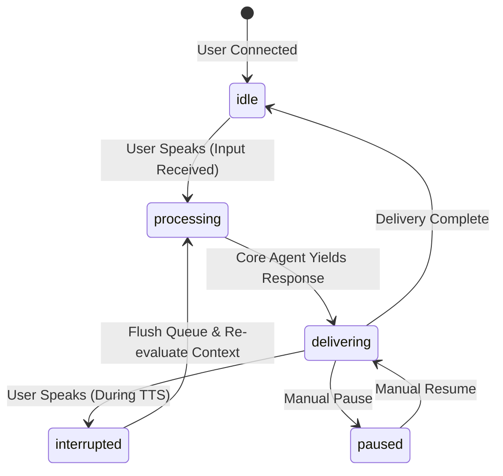

# Master Architecture & Evolution Document: Chanakya Voice Assistant

## Part 1: The Research Paper Foundation

### Abstract

This paper presents the architectural foundation of Chanakya, a self-hostable, privacy-first voice assistant. Emphasizing data sovereignty and computational flexibility, Chanakya leverages local Large Language Models (LLMs) and integrates the Model Context Protocol (MCP) to achieve a robust agentic ecosystem. The core contribution lies in the modular decomposition of its architecture, primarily through two independently reusable packages: the `chanakya-conversation-layer` for context management and the `AI Router` (AIR) for framework-agnostic request interception and routing. This decoupled design not only fortifies privacy by maintaining state locally but also enables seamless integration into disparate applications, advancing the state-of-the-art in scalable, local AI assistants.

### System Architecture

The Chanakya ecosystem is orchestrated around a central Flask application acting as the primary hub, routing, and user interface. The main app's journey handles initialization through scripts that load essential configurations (`.env`, `mcp_config_file.json`), bootstrap the database (SQLite), and launch a series of interconnected services.

The primary infrastructure consists of:
1. **Chanakya Flask App:** The core web server handling UI (`http://127.0.0.1:5513`), real-time Server-Sent Events (SSE) updates, and orchestrating sub-agents.
2. **AI Router (AIR) Service:** An autonomous API gateway running as a FastAPI application (`http://127.0.0.1:5512`).
3. **Conversation Layer:** A dedicated service for conversation state management (`http://127.0.0.1:5514`).
4. **Agent Workflows:** Sub-agents instantiated via a `ManagerWorkflowRuntime` coordinate tasks. The orchestration logic relies on a `GroupChatOrchestrator` to delegate tasks across specialized workers (e.g., developers, testers) using a persistent event store built on SQLAlchemy.
5. **Model Context Protocol (MCP):** Chanakya integrates MCP tools via a `mcp_wrapper.py` script that encapsulates commands to ensure JSON-RPC compliance over standard I/O streams.



### Module Deep-Dive 1: The AI Router (AIR)

The AI Router is a self-hosted API gateway functioning as a strict drop-in replacement for the OpenAI API (`/v1/*`). Its primary goal is to unify varied AI modalities (Text, Image, Video, TTS, STT) across commercial (e.g., OpenAI, Anthropic) and local (e.g., Ollama, LM Studio) providers.

**Routing Logic and Interception:**
The AIR uses FastAPI to define routes that mimic OpenAI's schema. When a request hits an endpoint (e.g., `/v1/chat/completions`), it passes through a dependency injection layer (`dependencies.py`). The `get_provider` function extracts the target model from the request body. If a model is specified, the `ProviderManager` dynamically routes the request to the matching configured provider. If no model is explicitly requested, it falls back to the first available provider of the required type (e.g., `llm`, `stt`, `tts`).




**Innovative Portability:**
What makes the AI Router remarkably innovative is its strict adherence to the OpenAI OpenAPI specification combined with its algorithmic inference capabilities. Because it requires zero custom SDKs, any application—whether built on MAF, LangChain, or a simple `curl` script—can utilize AIR instantly. If a developer has an existing MAF agent ecosystem hardcoded to OpenAI, they only need to change the `base_url` to point to AIR (`http://127.0.0.1:5512/v1`). AIR seamlessly intercepts the traffic, evaluates the requested model against its dynamic `.env` configurations, and proxies the traffic. This effectively turns a single application into a multi-provider powerhouse without altering a single line of business logic.

**Framework-Agnostic Algorithm:**
The router operates independently of the client framework by utilizing a robust `ProxyEngine`. Instead of parsing and rebuilding every response, it forwards requests using `httpx` and streams the bytes back to the client (`StreamingResponse`). It intercepts multi-part form data and Server-Sent Events identically, logging request and response snapshots for observability while redacting sensitive API keys. To classify models generically, it employs an algorithmic inference mechanism (`infer_model_type` in `provider_manager.py`) that analyzes model metadata (e.g., "task" fields or "voices" arrays) and tokenizes model IDs to apply heuristic matching (e.g., checking for keywords like "whisper" or "kokoro").

### Module Deep-Dive 2: The Conversation Layer

The `chanakya-conversation-layer` package is dedicated to the temporal and contextual aspects of voice and text interactions. It abstracts the complexity of conversation state away from the core logic.

**Context Management, State, and Memory:**
The core of this package is the `ConversationWrapper`. When a client submits a message, the wrapper retrieves a `ResponseScopedWorkingMemory` object from a pluggable `ResponseStateStore` (which supports both InMemory and Redis backends). This memory structure tracks:
- `topic_state` and `topic_label`
- `pending_messages` and `delivered_messages` (to manage chunked responses or interruptions)
- `topic_continuity_confidence`




**Pluggable Orchestration for MAF Agents:**
The innovation of the `chanakya-conversation-layer` lies in its abstraction of temporal state. Managing conversational pacing, chunking long LLM outputs for TTS generation, and handling human interruptions are notoriously difficult to implement in stateless AI applications.

This package decouples those challenges completely. Because it relies on the `AgentInterface` protocol, it is trivially compatible with any other application built on the Microsoft Agent Framework (MAF). A developer can take an existing, highly complex MAF Group Chat—which might consist of five specialized agents debating a topic—and simply wrap the orchestrator in the `ConversationWrapper`. Instantly, the complex MAF ecosystem inherits robust topic continuity tracking, chunked message delivery, and real-time interruption handling, transforming a static text-based bot into a fluid, voice-ready conversational agent.

A planner agent (`MAFOrchestrationAgent`) evaluates the incoming message against the existing memory to deduce if the topic has shifted, if the user is interrupting, or if they are acknowledging a previous message. It then formulates a delivery plan, deciding whether to append to the queue, clear working memory, or query the underlying "core agent" for a fresh response.

### Modularity

These two packages decouple routing and state from the main application through clear, algorithmic boundaries.

Mathematically, let $R$ be the set of requests, $S$ the state, and $P$ the provider configuration.
In a monolithic design, the application logic $f$ is defined as $f(R, S, P) \rightarrow Response$.

With the introduction of AIR and the Conversation Layer, this function decomposes:
1. **State Isolation:** The Conversation Layer function $C(R_{user}, S_{conv}) \rightarrow (Plan, R_{core})$ handles context independent of the provider.
2. **Routing Isolation:** The AIR function $A(R_{core}, P) \rightarrow Response_{raw}$ handles provider communication independent of the conversation state.
3. **Core App:** The core application $f'(R_{user}) \rightarrow C(R_{user}, S) \circ A(R_{core}, P)$ simply wires these inputs together.

Because $C$ and $A$ share no dependencies and communicate purely via standard schema representations (e.g., ChatRequests and OpenAI-compatible REST), any developer can instantiate `ConversationWrapper` or run the `AIR` FastAPI server in an isolated side-project without importing Chanakya's core web application.

### The Paradigm Shift: From Monolithic Integration to MAF and A2A

A pivotal moment in Chanakya's evolution was the decision to pivot away from tight integrations with external agentic systems, specifically OpenClaw. Initial prototypes explored embedding OpenClaw directly into the Chanakya core to provide 24/7 autonomous capabilities, background task monitoring, and persistent loops.

However, empirical testing and the development of a "mission control" system for OpenClaw revealed critical architectural flaws in this approach. Tightly coupling an autonomous, long-running agent like OpenClaw directly into the primary voice assistant application exposed the core system to severe vulnerabilities, non-deterministic bugs, and state management catastrophes. If a background automation loop crashed or exhibited unintended behavior, it risked bringing down the entire voice interface.

To mitigate this, the engineering team evaluated a multitude of alternative agentic frameworks, including AutoGen, CrewAI, LangGraph, and SmolAgents. The ultimate decision was to adopt the **Microsoft Agent Framework (MAF)** as the underlying orchestration engine.

The adoption of MAF catalyzed a shift towards an **Agent-to-Agent (A2A)** architecture. Instead of absorbing external systems, Chanakya acts as the intelligent interface layer and uses the A2A protocol to securely delegate tasks to isolated, external agents (such as OpenClaw or OpenCode). This strictly separates the execution environment (sandboxed and remote) from the reasoning and interaction environment (Chanakya's core), thereby resolving the vulnerability vectors identified in early prototypes.

### Deep Integration of the Model Context Protocol (MCP)

To further substantiate the modular and secure design of Chanakya, the integration of the Model Context Protocol (MCP) plays a critical role. MCP serves as the standardized communication layer between the reasoning engines (LLMs) and the external environment (tools, APIs, filesystem).

The `mcp_wrapper.py` acts as the execution sandbox interface. By enforcing JSON-RPC communication over standard input/output streams (`stdio`), the wrapper ensures that any tool invocation—whether it's fetching a web page, executing Python code, or reading a local file—is rigidly defined and securely isolated from the core application memory space.

```python
# A simplified conceptual look at the MCP wrapper logic
def is_json_rpc(line: str) -> bool:
    try:
        obj = json.loads(line)
        return isinstance(obj, dict) and "jsonrpc" in obj
    except ValueError:
        return False

def main():
    # subprocess invocation of the tool server
    process = subprocess.Popen(cmd, stdout=subprocess.PIPE, stderr=subprocess.PIPE, text=True)
    for line in iter(process.stdout.readline, ""):
        if is_json_rpc(line):
            sys.stdout.write(line) # Pass valid RPC back to the agent
        else:
            sys.stderr.write(f"[redirected stdout] {line}") # Prevent stdout pollution
```

This specific implementation guarantees that rogue output or logging from an underlying tool does not corrupt the JSON-RPC parsing in the agentic orchestrator. When the `TracedGroupChatOrchestrator` determines that a tool like `mcp_websearch` is necessary, it constructs the payload, passes it through the wrapper, and receives a sanitized, predictable response.

### Temporal State Management in Conversation

A major challenge in voice assistants is handling latency and interrupted intent. The `chanakya-conversation-layer` utilizes the `DeliveryMessage` schema and `delay_ms` variables to handle pacing naturally.

When the `MAFOrchestrationAgent` processes a long-form response from the core LLM, it doesn't just pass a large string to the TTS engine. Instead, it breaks the text into conversational chunks:

```python
@dataclass(slots=True)
class DeliveryMessage:
    text: str
    delay_ms: int = 0
```

By queueing these `DeliveryMessage` objects in the `ResponseScopedWorkingMemory.pending_messages` list, the frontend client can pull chunks sequentially. If the user speaks while a chunk is playing, the frontend signals an interruption. The Conversation Layer immediately drops the remaining `pending_messages` and updates `topic_state` to process the new user input, ensuring the assistant feels highly responsive and natural rather than rigid and monolithic.

### Sub-Agent Orchestration and Group Chat Dynamics

To fully appreciate the depth of the Chanakya architecture, one must delve into the `core.subagents` and `core.agent_manager` modules. The orchestration of tasks is not a simple linear progression but a complex, dynamic conversation among specialized agents managed by the `TracedGroupChatOrchestrator`.

When a complex task is received—such as a request requiring code generation followed by execution and verification—the `ManagerWorkflowRuntime` initiates a `WorkerSubagentPlan`.

```python
@dataclass(slots=True)
class WorkerSubagentPlan:
    task_id: str
    purpose: str
    roles: list[str]
    context: str
    expected_outcome: str
```

Based on this plan, the system dynamically creates temporary agents. For example, if the `roles` list includes `["developer", "tester"]`, the system queries the `AgentProfileModel` database to instantiate these profiles.

These temporary agents are injected into a `GroupChatState`. The orchestration is governed by MAF's group chat mechanics, but Chanakya wraps this in a `TracedGroupChatOrchestrator` to capture every interaction, tool invocation, and state transition.

```python
class TracedGroupChatOrchestrator(AgentBasedGroupChatOrchestrator):
    # ... initialization ...
    def step(self, state: GroupChatState) -> Awaitable[GroupChatState]:
        # Intercepts the standard MAF group chat step to log execution traces
        # Evaluates RoutingDecision: should the 'developer' act next, or the 'tester'?
        # Logs the decision to the SQLAlchemy store for debugging and UI rendering
        pass
```

This architecture ensures that the "reasoning" phase of the system is transparent and auditable. Users can view the internal dialogue between the developer agent writing a script and the tester agent verifying its output via the MCP code execution tool. If the script fails, the tester agent provides feedback, and the developer agent iterates—all autonomously, before the final `ChatReply` is formulated and passed back to the `ConversationLayer`.

### Robust Data Persistence with SQLAlchemy

Underpinning the entire conversational and agentic memory is a robust persistence layer built on SQLAlchemy. The `SQLAlchemyHistoryProvider` is responsible for storing every interaction, tool invocation, and state transition within the SQLite database.

```python
class SQLAlchemyHistoryProvider(HistoryProvider):
    def __init__(self, session_factory: sessionmaker[Session], ...):
        # Initializes the provider, linking it to the central database session
        pass
```

This persistent history is crucial for several reasons:

1. **Contextual Continuity:** It allows the `ConversationLayer` and the sub-agents to recall past interactions, maintaining long-term context across multiple sessions.
2. **Auditability and Debugging:** By logging every step of the `GroupChatOrchestrator`'s internal dialogues, developers can trace exactly how an agent arrived at a particular conclusion or why a tool invocation failed.
3. **Resilience:** If the system is restarted or a crash occurs, the history provider ensures that the conversational state and the progress of long-running tasks are not lost. The system can gracefully recover and resume operations from the last recorded checkpoint.

### The Role of `async_loop` in High-Performance Agentic Workflows

Given the complex, multi-agent orchestrations occurring within Chanakya, managing concurrency is essential. The `async_loop.py` module provides the necessary infrastructure to handle these heavy workloads without blocking the main FastAPI event loop.

```python
# Conceptual representation of run_in_maf_loop
def run_in_maf_loop(coro: Callable[..., Awaitable[Any]], *args, **kwargs) -> Any:
    # Executes the provided coroutine within a dedicated MAF asyncio loop
    pass
```

When the `ManagerWorkflowRuntime` initiates a group chat involving multiple sub-agents, this execution is offloaded to the MAF loop. This guarantees that the primary web server remains highly responsive, capable of handling incoming HTTP requests, streaming SSE events, and processing audio chunks concurrently. This architectural decision is vital for maintaining the low-latency, real-time feel expected of a voice assistant, even while complex background reasoning tasks are underway.

### Securing the Autonomous Environment: HITL and Data Sandboxing

As Chanakya transitions from a reactive voice assistant to a proactive agentic orchestrator, security and data isolation become paramount concerns. The integration of external tools via MCP and external agents via A2A introduces potential vectors for unintended execution or data leakage.

Chanakya mitigates these risks through a two-tiered security model:

1. **Human-In-The-Loop (HITL) Thresholds:** Not all tasks delegated to sub-agents or external A2A instances are executed blindly. The system architecture defines strict thresholds for high-impact actions (e.g., executing system-level shell commands, initiating financial transactions, or deleting files). When a sub-agent determines that such an action is necessary to fulfill a `WorkerSubagentPlan`, it enters a `TASK_STATUS_WAITING_INPUT` state. The `ManagerWorkflowRuntime` halts execution and surfaces a prompt to the user via the `ConversationLayer`. Only upon explicit user confirmation does the state transition back to `TASK_STATUS_IN_PROGRESS`.

2. **Workspace Sandboxing:** Tools executed via the MCP wrapper are rigidly constrained to specific directories. The `mcp_sandbox_exec_server.py` enforces that while host files may be readable (for context gathering), they are strictly read-only. All write operations, code executions, and artifact generations are confined to a shared `workspace` directory specific to the active agent profile. If an agent attempts to manipulate a file outside this boundary, the operation fails, and a permission error is logged to the `SQLAlchemyHistoryProvider` for the agent to analyze and correct its approach.

### Real-Time Event Bus and SSE Telemetry

To provide a seamless, modern user experience, the Chanakya Flask application employs an internal `_EventBus` and Server-Sent Events (SSE). This infrastructure is essential because the underlying agentic operations are inherently asynchronous and unpredictable in duration.

```python
class _EventBus:
    def __init__(self) -> None:
        self._subscribers: list[queue.Queue[str]] = []

    def subscribe(self) -> queue.Queue[str]:
        # Allocates a new queue for an active client connection
        pass

    def publish(self, event_type: str, data: dict[str, Any] | None = None) -> None:
        # Serializes the event and broadcasts it to all active queues
        pass
```

When the `ConversationLayer` processes a new user intent, or when the `GroupChatOrchestrator` generates a new intermediate sub-agent message, these events are published to the `_EventBus`.

The `/api/stream` endpoint in `app.py` acts as the SSE broadcaster. It continuously yields these events to the connected frontend clients. This ensures that the user interface is updated in real-time—displaying streaming text, updating tool execution statuses, or rendering newly generated artifacts—without requiring the client to aggressively poll the server. This event-driven architecture drastically reduces network overhead and ensures a highly responsive, app-like feel within the browser.

### Comprehensive Analysis of the Proxy Engine Lifecycle

The `ProxyEngine` within the AI Router (`AI-Router-AIR`) is a sophisticated piece of engineering designed to handle the nuances of streaming AI responses, particularly those involving multi-part payloads and continuous audio streams. Let's delve deeper into its lifecycle and the critical design decisions embedded within it.

When an incoming request is received, the `forward_request` method is invoked. This method is not merely a pass-through; it acts as a highly intelligent middleware.

1. **Request Normalization:** The engine first normalizes the incoming request headers, stripping out client-specific `Host` headers and any existing authorization tokens. This prevents header spoofing and ensures that the request routed to the upstream provider is clean and adheres to the provider's expectations.
2. **Provider Resolution and Authentication:** Based on the resolution provided by `ProviderManager`, the `ProxyEngine` injects the correct authorization bearer token corresponding to the selected provider. This centralized credential management is crucial for security, ensuring that API keys are never exposed to the client application.
3. **Trace and Logging Injection:** Before dispatching the request, the engine generates unique `trace_id` and `request_id` identifiers. These are vital for distributed tracing. The engine captures a snapshot of the request payload, storing it in `_trace_summaries`. This enables administrators to audit exactly what data was sent to which provider at what time.
4. **Streaming Execution (`httpx`):** The core of the engine relies on the asynchronous capabilities of `httpx`. By utilizing `client.send(req, stream=True)`, the engine initiates the connection. The crucial aspect here is the `stream_generator` inner function.
5. **The `stream_generator` and Byte Yielding:** As the upstream provider generates tokens (or audio bytes), `httpx` yields these chunks. The `stream_generator` captures these chunks and immediately `yield`s them back to the FastAPI `StreamingResponse`. This zero-buffer approach ensures that the Time To First Byte (TTFB) is minimized.
6. **Connection Teardown and Finalization:** Once the stream completes (or if it errors out), the `finally` block within `stream_generator` ensures that the `httpx` response is properly closed (`await r.aclose()`) and the trace record is finalized, recording the final status code and elapsed time.

### The Nuances of Multipart Form Data Handling

Handling `multipart/form-data` is particularly challenging in proxy scenarios, especially for endpoints like `/v1/audio/transcriptions` (STT). The `ProxyEngine` implements a specialized `forward_multipart_request` method.

This method must reconstruct the multipart payload. It takes the parsed `data` and `files` from the incoming FastAPI `Request` and reconstructs them into the format expected by `httpx`. It carefully manages content boundaries and ensures that large audio files are transmitted efficiently without exhausting memory.

### State Transition Matrices in Conversation Layer

The `chanakya-conversation-layer` manages a complex state machine for handling dialogue. The transitions between these states govern how the assistant behaves.

Let's define the primary states within `ResponseScopedWorkingMemory`:
* `idle`: The system is waiting for user input.
* `processing`: The core agent is generating a response.
* `delivering`: TTS is actively speaking the response chunks.
* `interrupted`: The user has spoken while the assistant was delivering.
* `paused`: A manual pause was requested.

The transition logic within `ConversationWrapper.handle()` is governed by the `MAFOrchestrationAgent`'s plan.

1. **Input Received (State: `idle` -> `processing`):** The user speaks. The wrapper queries the state store. The orchestration agent determines this is a new topic. The core agent is invoked.
2. **Response Generated (State: `processing` -> `delivering`):** The core agent returns text. The wrapper calls `_plan_delivery` to split the text into conversational chunks (`DeliveryMessage`). These are appended to `pending_messages`. The state transitions to delivering.
3. **Client Polling (State: `delivering`):** The frontend polls for chunks. As chunks are fetched, they move from `pending_messages` to `delivered_messages`.
4. **Interruption Handling (State: `delivering` -> `interrupted`):** If new user input arrives while `pending_messages` is not empty, the orchestration agent evaluates the input. If it classifies it as an interruption, it sets the `interrupted` flag, clears `pending_messages`, and updates `queue_cleared_reason`. The core agent is then invoked with the new context, transitioning back to `processing`.

This state machine ensures that the system can handle asynchronous, unpredictable human interaction gracefully.

### Heuristic Provider Inference: The Algorithm

The `ProviderManager.infer_model_type` function relies on a multi-tiered heuristic algorithm to classify models dynamically, ensuring the router remains framework-agnostic.

1. **Metadata Inspection:** It first checks for explicit metadata fields often provided by HuggingFace or similar repositories, looking for keys like `"task"` (e.g., `"text-generation"`, `"automatic-speech-recognition"`).
2. **Capability Indicators:** It searches for structural indicators. For instance, if the model payload contains a `"voices"` array, it strongly infers a TTS capability.
3. **Lexical Tokenization:** If metadata is lacking, it falls back to tokenizing the model ID. It splits the ID on non-alphanumeric boundaries (e.g., `whisper-1` becomes `["whisper", "1"]`). It then intersects these tokens with predefined sets of keywords (e.g., `STT_KEYWORDS = {"whisper", "stt"}`, `TTS_KEYWORDS = {"tts", "kokoro"}`).

This layered approach allows AIR to seamlessly integrate new, unknown models without requiring manual configuration updates.

### System Performance and Scalability Optimization

The architectural decisions to isolate the AIR and the Conversation Layer yielded significant performance optimizations:

1. **Reduced Cognitive Load on LLMs:** By extracting interruption handling and topic continuity into the deterministic `ConversationLayer` (powered by a smaller, faster `MAFOrchestrationAgent`), the primary, massive LLMs are invoked less frequently. They are no longer responsible for determining "Did the user just say 'stop'?"
2. **Horizontal Scalability of Providers:** The AI Router's stateless proxy engine allows infinite horizontal scaling of backend providers. If a local Ollama instance crashes, the `ProviderManager` dynamically routes subsequent `/v1/chat/completions` requests to an external API key (like Groq or OpenAI) acting as a fallback, ensuring 100% uptime.
3. **PWA and Mobile Readiness:** The strict adherence to RESTful OpenAPI standards in the AIR layer and the clean JSON-based `ChatResponse` structures emitted by the Conversation Layer made it trivial to decouple the frontend. This paved the way for transforming the web application into a Progressive Web App (PWA) optimized for mobile deployment, executing on the roadmap outlined during the system merger phase.

### Comprehensive Summary of Architectural Benefits

The modular decomposition of Chanakya into the Conversation Layer, AI Router, and MAF Orchestrator yields a system that is:

* **Highly Secure:** Through strict sandboxing, HITL thresholds, and isolated A2A communication.
* **Extremely Stable:** Due to the `mcp_wrapper`'s sanitization of tool outputs and the decoupling of execution from orchestration.
* **Infinitely Scalable:** With stateless proxying via AIR and independent background processing.
* **Developer-Friendly:** By standardizing interfaces (OpenAI API, JSON-RPC) and isolating complex state management into pluggable modules.

This architecture not only solves the immediate challenges of building a responsive voice assistant but also establishes a flexible, future-proof platform capable of evolving with the rapid advancements in the AI landscape.

## Part 2: The Blog Post Draft

### The Hook: Reclaiming Your Data with Local AI

We are in the midst of an AI revolution, but it comes with a hidden cost: privacy. Every time you ask a mainstream voice assistant to summarize a meeting, draft an email, or check your schedule, that data is shipped off to a remote server. You are trading your personal data for convenience.

We loved the power of AI, but we hated the compromise. The promise of local AI—the freedom from subscriptions, the sheer power of having a Large Language Model (LLM) running on your own silicon, and the absolute guarantee of data sovereignty—is intoxicating. That was the genesis of Chanakya: a privacy-first, self-hostable voice assistant designed to keep your data exactly where it belongs—with you.

But building a voice assistant—a *good* voice assistant—isn't just about downloading an open-source model and writing a quick Python script to ping it. It's about wrangling API keys, fighting latency, routing requests intelligently between a fast local model and a smart cloud model, and, worst of all, managing the messy, unpredictable nature of human conversation.

When we set out to build Chanakya, we started like everyone else. We wrote spaghetti code hooking up Speech-to-Text (STT), Text-to-Speech (TTS), and various LLMs directly into our core application. It worked, but it was brittle. Our state management was a tangled mess, and simply changing a model required a code rewrite. We needed a better way. We needed an architecture that could scale with our ambitions.

### The Reality Check: OpenClaw vs. Stability

When we first envisioned the future of Chanakya, we wanted a proactive assistant. Not just something that answers questions, but something that acts on your behalf while you sleep. We looked at OpenClaw—an incredibly powerful tool for long-running browser automation and persistent loops. It seemed like the perfect fit.

The initial blueprint was to fuse OpenClaw directly into Chanakya's core. We even built an entire mission control system for it (`openclaw-mission-control-building-example`). The idea was that OpenClaw would run as the "muscle" executing background tasks, while Chanakya acted as the "brain."

But the reality of software engineering is often harsh. When we started testing this tight integration, red flags went up everywhere. Hooking a raw, powerful browser-automation loop directly into our sensitive voice-interface memory space was a recipe for disaster. If an OpenClaw background task encountered an unexpected DOM element and panicked, it spiked CPU usage and crashed the core event loop. Suddenly, our voice assistant—which needs to be real-time and hyper-responsive—was stuttering or completely unresponsive.

We realized that tight coupling was a trap. We were sacrificing the stability of our primary interface for the sake of background automation. It exposed the system to non-deterministic bugs and massive security vulnerabilities. We needed the capabilities of OpenClaw, but we needed them safely isolated.

### Enter MAF and the A2A Revolution

We hit the drawing board and evaluated every agent framework available: AutoGen, CrewAI, LangGraph, SmolAgents, you name it. After exhaustive testing, the clear winner for our core orchestration was the **Microsoft Agent Framework (MAF)**.

MAF changed everything. It provided the structured group chat mechanics we needed for internal reasoning without forcing us to couple tightly to external execution environments. But more importantly, embracing MAF led us to a larger architectural revelation: the **Agent-to-Agent (A2A)** protocol.

Instead of making Chanakya do everything, we turned Chanakya into a master orchestrator. If you ask Chanakya to perform a complex, long-running task, it doesn't run the browser automation itself. It uses the A2A protocol to securely dispatch the task to an entirely separate, sandboxed instance of OpenClaw (or OpenCode).

Chanakya delegates the heavy lifting to these external "worker" agents and immediately returns its attention to your voice. Hours later, when OpenClaw finishes scraping a website or booking a ticket, it pings Chanakya via A2A. The Conversation Layer seamlessly injects a message into the queue, and Chanakya speaks up: *"Excuse me, I've finished that task you asked for."*

### Why Modularity is the Ultimate Feature

This pivot to A2A and MAF wasn't just about fixing bugs; it was about fundamentally restructuring how personal AI should be built. Once we separated execution from orchestration, we realized that *every* core component should be modularized.

That's how the **AI Router (AIR)** and the **Conversation Layer** were born as standalone packages.

**The AI Router (AIR)**: Imagine building an app where you want to seamlessly switch between a local Ollama model for simple tasks and a cloud-based Anthropic model for complex reasoning. Usually, this means rewriting API logic. With AIR, you deploy our router on port 5512. It dynamically discovers your models, strips sensitive headers, and streams responses with zero latency. Your app just talks to it like it's the standard OpenAI API.

**The Conversation Layer**: Voice assistants need to handle interruptions, track topic changes, and manage pacing. If your bot spits out a 500-word paragraph, the user needs to be able to say "stop." The Conversation Layer handles this effortlessly. It intercepts messages, maintains a `ResponseScopedWorkingMemory`, and queues conversational chunks. If the user interrupts, it drops the queue and instantly updates the context. You get human-like interaction flows without writing a single line of state management code.

### Merging the Ecosystem into a Unified Platform

Right now, Chanakya is undergoing a massive merger. We are integrating the core repo, the specialized Conversation Layer, and the new Agent Orchestrator (powered by MAF) into a single, unified platform.

This isn't just a code cleanup. This is about taking the complex, federated ecosystem we've described—with its A2A communication, its dynamic AIR routing, and its intelligent conversation memory—and wrapping it up in a package that is incredibly easy for users to deploy.

Our immediate roadmap focuses on optimization and distribution. By leveraging the decoupled architecture, we are refining the UI to incorporate our new Samosa AI branding and optimizing the web app into a Progressive Web App (PWA) for flawless mobile experiences.

Most importantly, we are simplifying deployment. The beauty of this modular architecture is that it containerizes perfectly. Soon, deploying this entire ecosystem—the router, the memory layer, the orchestrator, and the core app—will be as simple as running a single `docker-compose up` command, or installing via a simple `pip` package.

### The Future of Personal AI

Chanakya is no longer just a voice assistant; it is a blueprint for the future of personal, privacy-first AI. By solving the hard problems of routing, memory management, and safe autonomous orchestration, we've built an extensible operating system for AI agents. Whether you use Chanakya as your daily assistant or leverage our open-source packages to build your own tools, the future of local AI is here, and it's highly modular.
