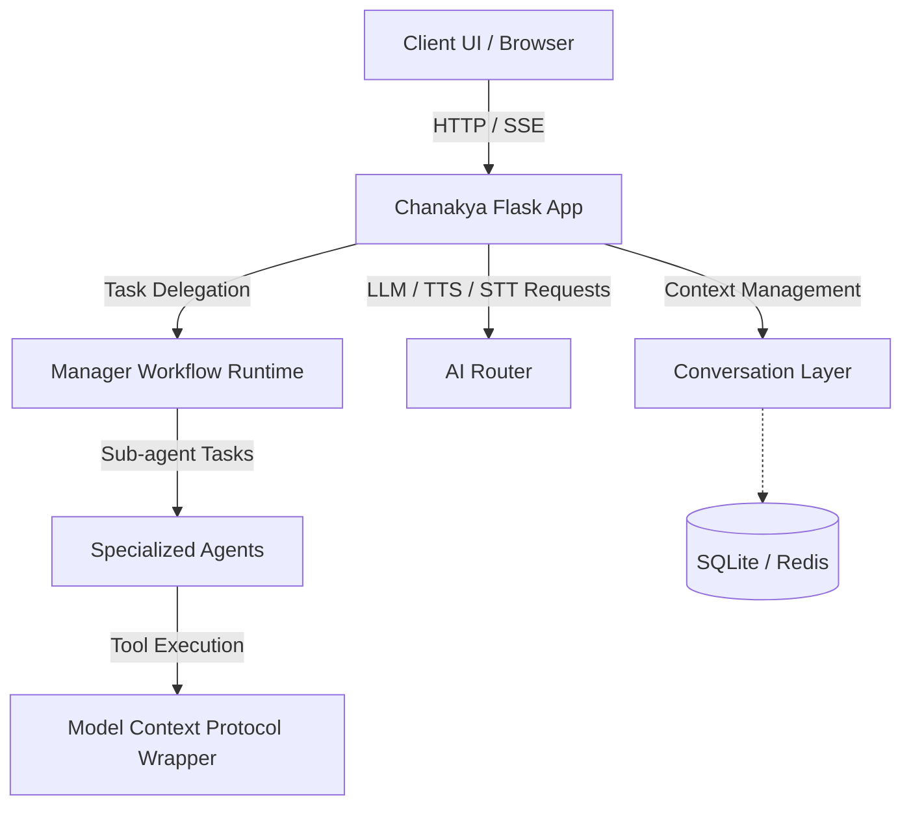

# Master Architecture & Evolution Document: Chanakya Voice Assistant

## Part 1: The Research Paper Foundation

### Abstract

This paper presents the architectural foundation of Chanakya, a self-hostable, privacy-first voice assistant. Emphasizing data sovereignty and computational flexibility, Chanakya leverages local Large Language Models (LLMs) and integrates the Model Context Protocol (MCP) to achieve a robust agentic ecosystem. The core contribution lies in the modular decomposition of its architecture, primarily through two independently reusable packages: the `chanakya-conversation-layer` for context management and the `AI Router` (AIR) for framework-agnostic request interception and routing. This decoupled design not only fortifies privacy by maintaining state locally but also enables seamless integration into disparate applications, advancing the state-of-the-art in scalable, local AI assistants.

### System Architecture

The Chanakya ecosystem is orchestrated around a central Flask application acting as the primary hub, routing, and user interface. The main app's journey handles initialization through scripts that load essential configurations (`.env`, `mcp_config_file.json`), bootstrap the database (SQLite), and launch a series of interconnected services.

The primary infrastructure consists of:
1. **Chanakya Flask App:** The core web server handling UI (`http://127.0.0.1:5513`), real-time Server-Sent Events (SSE) updates, and orchestrating sub-agents.
2. **AI Router (AIR) Service:** An autonomous API gateway running as a FastAPI application (`http://127.0.0.1:5512`).
3. **Conversation Layer:** A dedicated service for conversation state management (`http://127.0.0.1:5514`).
4. **Agent Workflows:** Sub-agents instantiated via a `ManagerWorkflowRuntime` coordinate tasks. The orchestration logic relies on a `GroupChatOrchestrator` to delegate tasks across specialized workers (e.g., developers, testers) using a persistent event store built on SQLAlchemy.
5. **Model Context Protocol (MCP):** Chanakya integrates MCP tools via a `mcp_wrapper.py` script that encapsulates commands to ensure JSON-RPC compliance over standard I/O streams.

### Module Deep-Dive 1: The AI Router (AIR)

The AI Router is a self-hosted API gateway functioning as a strict drop-in replacement for the OpenAI API (`/v1/*`). Its primary goal is to unify varied AI modalities (Text, Image, Video, TTS, STT) across commercial (e.g., OpenAI, Anthropic) and local (e.g., Ollama, LM Studio) providers.

**Routing Logic and Interception:**
The AIR uses FastAPI to define routes that mimic OpenAI's schema. When a request hits an endpoint (e.g., `/v1/chat/completions`), it passes through a dependency injection layer (`dependencies.py`). The `get_provider` function extracts the target model from the request body. If a model is specified, the `ProviderManager` dynamically routes the request to the matching configured provider. If no model is explicitly requested, it falls back to the first available provider of the required type (e.g., `llm`, `stt`, `tts`).

**Framework-Agnostic Algorithm:**
The router operates independently of the client framework by utilizing a robust `ProxyEngine`. Instead of parsing and rebuilding every response, it forwards requests using `httpx` and streams the bytes back to the client (`StreamingResponse`). It intercepts multi-part form data and Server-Sent Events identically, logging request and response snapshots for observability while redacting sensitive API keys. To classify models generically, it employs an algorithmic inference mechanism (`infer_model_type` in `provider_manager.py`) that analyzes model metadata (e.g., "task" fields or "voices" arrays) and tokenizes model IDs to apply heuristic matching (e.g., checking for keywords like "whisper" or "kokoro").

### Module Deep-Dive 2: The Conversation Layer

The `chanakya-conversation-layer` package is dedicated to the temporal and contextual aspects of voice and text interactions. It abstracts the complexity of conversation state away from the core logic.

**Context Management, State, and Memory:**
The core of this package is the `ConversationWrapper`. When a client submits a message, the wrapper retrieves a `ResponseScopedWorkingMemory` object from a pluggable `ResponseStateStore` (which supports both InMemory and Redis backends). This memory structure tracks:
- `topic_state` and `topic_label`
- `pending_messages` and `delivered_messages` (to manage chunked responses or interruptions)
- `topic_continuity_confidence`

A planner agent (`MAFOrchestrationAgent`) evaluates the incoming message against the existing memory to deduce if the topic has shifted, if the user is interrupting, or if they are acknowledging a previous message. It then formulates a delivery plan, deciding whether to append to the queue, clear working memory, or query the underlying "core agent" for a fresh response.

### Modularity

These two packages decouple routing and state from the main application through clear, algorithmic boundaries.

Mathematically, let $R$ be the set of requests, $S$ the state, and $P$ the provider configuration.
In a monolithic design, the application logic $f$ is defined as $f(R, S, P) \rightarrow Response$.

With the introduction of AIR and the Conversation Layer, this function decomposes:
1. **State Isolation:** The Conversation Layer function $C(R_{user}, S_{conv}) \rightarrow (Plan, R_{core})$ handles context independent of the provider.
2. **Routing Isolation:** The AIR function $A(R_{core}, P) \rightarrow Response_{raw}$ handles provider communication independent of the conversation state.
3. **Core App:** The core application $f'(R_{user}) \rightarrow C(R_{user}, S) \circ A(R_{core}, P)$ simply wires these inputs together.

Because $C$ and $A$ share no dependencies and communicate purely via standard schema representations (e.g., ChatRequests and OpenAI-compatible REST), any developer can instantiate `ConversationWrapper` or run the `AIR` FastAPI server in an isolated side-project without importing Chanakya's core web application.

---

## Part 2: The Blog Post Draft

### The Hook

We love local AI. The promise of privacy, the freedom from subscriptions, and the sheer power of having an LLM running on your own silicon is intoxicating. But building a voice assistant—a *good* voice assistant—isn't just about pinging an LLM. It's about wrangling API keys, dealing with latency, routing requests between a fast local model and a smart cloud model, and, worst of all, managing conversation state.

When we set out to build Chanakya, our privacy-first, self-hostable voice assistant, we started like everyone else: spaghetti code hooking up STT, TTS, and LLMs directly into our core app. But quickly, we hit a wall. Our code was brittle, our state was a mess, and changing models required a rewrite. We needed a better way.

### The "Aha!" Moment

The breakthrough came when we realized that routing AI requests and managing conversational memory are universal problems. They aren't unique to Chanakya.

Why should our main application know that we switched from an OpenAI cloud model to a local Ollama instance? It shouldn't. Why should our core task-execution logic care if the user interrupted the voice assistant mid-sentence? It shouldn't.

That was our "Aha!" moment. We stopped building a monolithic assistant and started building an ecosystem. We extracted two massive pieces of logic into completely independent, standalone, open-source packages: the **AI Router (AIR)** and the **Chanakya Conversation Layer**.

These aren't just submodules; they are reusable powerhouses. AIR became an autonomous proxy that unified every AI provider under a single OpenAI-compatible API. The Conversation Layer became an intelligent wrapper that could take *any* stateless agent and instantly endow it with interruption handling, topic tracking, and message queuing.

### How it Works (Simply)

Because we built them as standalone packages, you can drop them into your own side project today. Here’s how simple it is:

**1. The AI Router (AIR)**
Imagine you're building a script that uses OpenAI, but halfway through, you want to test a local model on LM Studio. Usually, you'd rewrite your API calls. With AIR, you just run the AIR server (which lives on port 5512). It acts as a middleman. You point your standard OpenAI SDK at `http://localhost:5512/v1`, and AIR handles the rest. It uses dynamic discovery to figure out what models you have (TTS, STT, or LLM) and routes the request seamlessly. To your app, everything just looks like OpenAI.

**2. The Conversation Layer**
Say you built a simple CLI chatbot. It answers questions, but it has the memory of a goldfish, and if it replies with a massive paragraph, you can't interrupt it. By wrapping your bot in the `ConversationLayer`, you instantly get superpowers.

The Conversation Layer sits in front of your bot. When a user sends a message, the layer checks its internal memory (backed by Redis or just memory). If the user says "Stop!", the layer intercepts it, clears the pending message queue, and tells your bot, "The user interrupted." If the user says "Tell me more," it manages the topic continuity. You don't have to write a single line of state management code—you just focus on making your bot smart.

By breaking Chanakya into these modular pieces, we didn't just build a better voice assistant. We built tools that let *anyone* build a better voice assistant.